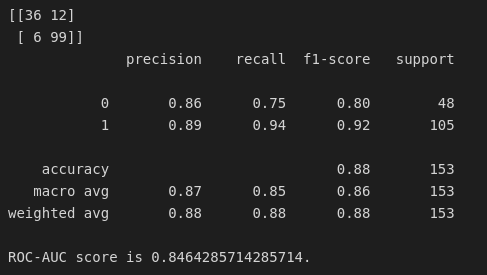

# Mini-project IV

### [Assignment](assignment.md)

## Project/Goals
Goal of the project is to predict the probability that an individual will be approved for a loan, based on some information provided about the individual.

The project is focused on using pipelines to streamline the modeling process, as well as using Flask to create an API with the predicted results.

## Hypothesis
Originally, I thought applicant income would play the largest role; however, after the EDA...I was wrong.

## EDA 

Based on the EDA, credit history plays by far the biggest role; after some additional analysis, a very high loan amount-to-income ratio may also play a role (a Loan-to-income ratio above about 12 leads to a much lower chance of loan approval).

Male individuals are also less likely to be approved for a loan in certain circumstances. A unmarried male with a higher income than a married male is less likely to be approved for a loan (this may be due to co-applicant income).

Details of the analyses are in the document *instructions.ipynb*.

## Process
EDA - Followed instructions in the notebook file. 
Modeling - 

Feature engineering - Main approaches taken:
-  Categorical variables one-hot encoded (*i.e* new variables created; value of '1' if it takes value of variable, '0' otherwise). 
- Total income considered (applicant + co-applicant income)
- Loan amount-to-total income considered as variable

Various classifications considered, as well as ensembling techniques used

## Results/Demo

Specific results for one test run:

'0' represents loan rejections
'1' represents loan approvals




'Best' parameters used from hyperparameter tuning (apart from defaults):

```
 {'classifier__logr__max_iter': 100,
 'classifier__xgb__colsample_bytree': 1,
 'classifier__xgb__max_delta_step': 5,
 'classifier__xgb__max_depth': 10,
 'featureunion__pca__n_components': 3,
 'featureunion__select_best__k': 3}
```

API is run in the file /src/app.py. API is accessed through *instructions.ipynb* file. 


## Challanges 
Time was a factor, as the simulation takes time to run (on the order of 1-5 hours, depending on extent of hyperparameter tuning). Parallelizing run would be ideal.


## Future Goals
More relevant data would have better results; a financial institution would likely be able to gather more data to better evaluate an application anyway. 


